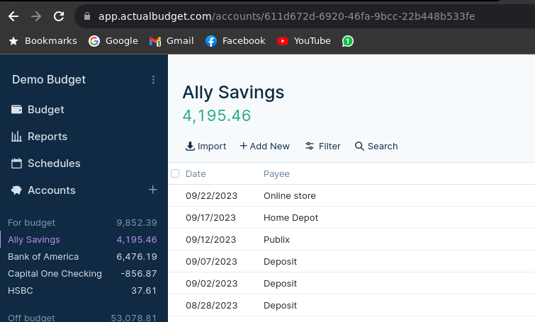

Project API to create Transactions on 'Actual Budget'
-

-- Actual Budget link

This project provides a docker image on nodejs 18, that allows consume the 'actual budget node sdk/api' to create transactions on a account.


The account must exist on the Actual Server.

Docker Environment params:
-
- SERVER_URL: The url where the 'Actual budget' is hosted, with port.
- BUDGET_ID: This is the ID from Settings → Show advanced settings → Sync ID

- SERVER_PASSWORD: This is the password you use to log into the server


Comand to run the docker:
```
sudo docker run -p 49160:8080 -e BUDGET_ID="xxxxxxx-7e2b-404e-8399-ccbf88442328" -e SERVER_URL="https://actual.myhostserver.com" -e SERVER_PASSWORD="myActualPassword" ghcr.io/lordvault/actual-budget-rest-api:latest
```

docker-compose:

```
version: "3"
services:

  actual-rest-api:
    image: ghcr.io/lordvault/actual-budget-rest-api:latest
    restart: always
    container_name: actual-rest-api
    network_mode: host
    ports:
      # Host port 49160 is mapped to container port 8080
      - 49160:8080
    environment:
      # The container is run as the user with this PUID and PGID (user and group id).
      # - TZ=${TZ} Optional, this avoid date issues for transactions
      # - GENERATE_UNIC_ID=true 
      - SERVER_URL=https://actual.myhostserver.com
      - SERVER_PASSWORD=myActualPassword
      - BUDGET_ID=xxxxxx-7e2b-404e-8399-ccbf88442328
```     

GENERATE_UNIC_ID = Boolean, this generates an unique id for each transaction. https://actualbudget.org/docs/api/reference#transaction they mention "Transactions with the same imported_id will never be added more than once.". But anyways 2 transaction with different imported_id, are not created twice. (NOT WORKING)

TZ = Your timezone, ie America/Bogota. Review your Actual server has the same timezone. 


REST SERVICE PARAMS:
-
- accountId: The id of the account to add the transaction. (you can get the id from the URL of the actual UI)

- amount: The amount of money on cents. For $1 you need to send 100 as value.
- payee: The payee associated to the transaction, if not exists, the actual creates the payee automatically
- notes: Notes to add on the transaction, the system already adds: "API-created 2023-03-21 12:24 - {your_note}"


CURL to consume the API:
```
curl --location 'http://actual.myhostserver.com/' \
--header 'Content-Type: application/json' \
--data '{
    "accountId": "eeeeeeee-1111-4444-1111-d42a4a7b82cb",
    "amount": 13500,
    "payee": "Banco de bogota",
    "notes": "Tasker"
}'
```


Personal usage
- 
This api was created to use with mobile app 'Tasker', reading the bank notifications i can get the Payee and amount information of my transactions. (For this moment only payments). 
With that information i avoid to have to enter manually the information on the 'Actual Budget' server.


Pending Features
- 
[ ] Add security to rest service (App token)

[ ] Support income transactions.

[ ] Automatic taxes. In colombia some account adds a fee over the transaction named '4x1000'. The idea its to receive a flag on the request with the account, to apply the fee on the transaction.

[ ] 
 

Detected Issues:
- 
- Sometimes a PostError its generated cuz the system cant communicate with the actual server. This breaks the system and stop the container.